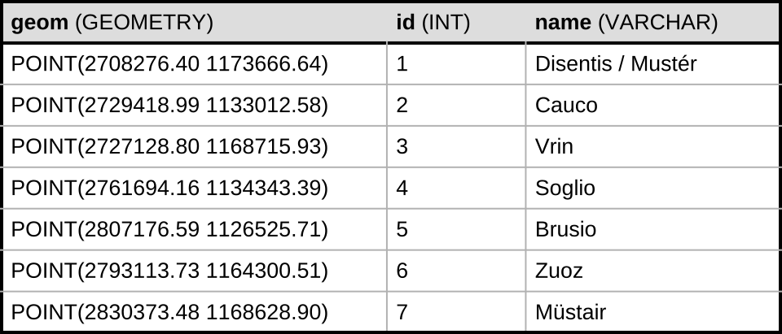
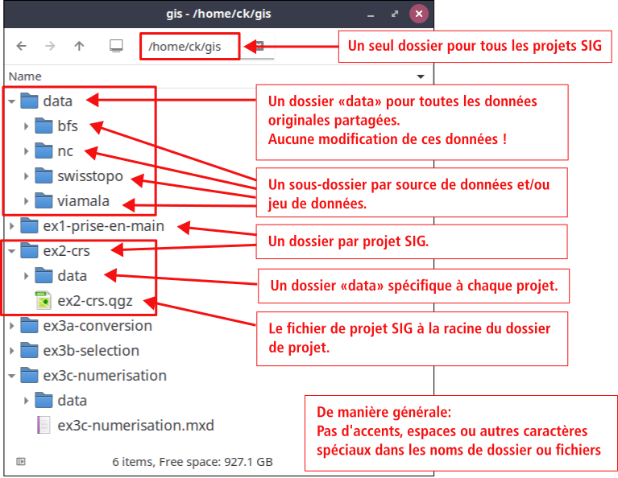

<style>
    .container {
        display: flex;
    }
    .col {
        flex: 1;
    }
    img {
        max-height: 550px;
    }
</style>

# Géoinformatique 1: Introduction aux SIG

Christian Kaiser  
Tom Beucler


---

# Quiz

- pas de quiz cette semaine


---

# Objectifs

- comprendre ce que c'est un SIG et la géomatique

- connaître les concepts de base du SIG:
    - couches vectorielles et raster
    - les systèmes de coordonnées

- comprendre le principe d'un projet SIG


---

# La géomatique

- géomatique = « géo » (donc la Terre) + « matique » (d’informatique)  
  &rarr; traitement automatique de l’information géographique

Ou plus formellement:

- «La géomatique est la **discipline** qui regroupe l’ensemble des **connaissances, méthodes, outils et technologies** nécessaires à **l’acquisition**, au **traitement**, au **stockage**, la **représentation** et la **diffusion** de **données** décrivant un objet localisé dans l'espace **géographique**.»

---

# Système d'information

Donc pas juste un Système d'information géographique, mais n'importe quel système d'information tout court...

- Système d'information = SI:

    - ensemble organisé de ressources techniques et humaines...
    - qui permet de collecter, stocker, traiter et diffuser une information

---

# Système d'information

Un SI est composé de 4 composantes:

- un ensemble de tâches à accomplir (les processus opérationnels, en anglais «business processes»)
- les personnes impliquées
- la structure organisationnelle (les rôles)
- la technologie

&rarr; bien plus qu'un logiciel informatique  
&rarr; inclut toute l'infrastructure nécessaire pour fonctionner

---

# Système d'information géographique (SIG)

Un SIG est un **système d'information** conçu pour collecter, stocker, gérer, traiter, analyser et diffuser des **données géographiques**.

Par rapport à un SI général:

-  se distingue par sa capacité de pouvoir manipuler les informations localisées dans l'espace géographique

&rarr; un SIG n'est pas un outil de cartographie (même si un SIG intègre la possibilité de faire des cartes)

&rarr; un SIG ne peut pas être réduit à un logiciel (même complexe) tel que QGIS ou ArcGIS

---

# Concepts de base du SIG

**Important!**

Le SIG sépare:

- la logique de stockage des données
- de la représentation de ces données.

---

# SIG: stockage des données

Le SIG encode les données géographiques principalement sous deux formes:

- les couches vectorielles (géométries + attributs)
- les couches raster (grille régulières avec 1 à plusieurs valeurs par cellule)

Les données sont enregistrées sous différentes formes:

- sous forme de fichier sur le disque dur
- dans une base de données (une base de données relationnelle généralement)
- sous forme d'un service Web

---

# SIG: représentation des données

Le SIG définit la représentation des données dans un **fichier de projet SIG**

- p.ex. un «projet QGIS» = un fichier avec extension .qgz

Le fichier de projet SIG contient:

- un **lien** vers les données (et non pas les données elles-mêmes)

- un **système de coordonnées** pour l'affichage des données (indépendemment du système de coordonnées des données)

- un **style** qui définit la façon de représenter chacune des couches

---

# Couche vectorielle (dans une base de données):



&rarr; généralement géométrie avec système de coordonnées, mais pas toujours

---

# Couche vectorielle (format GeoJSON):

```json
{
    "type": "FeatureCollection",
    "crs": { "type": "name", "properties": { "name": "urn:ogc:def:crs:OGC:1.3:CRS84" } },
    "features": [
        {
            "type": "Feature",
            "properties": {
                "id": 2,
                "name": "Cauco"
            },
            "geometry": {
                "type": "Point",
                "coordinates": [ 9.11958, 46.33603 ]
            }
        },
        {
            "type": "Feature",
            ...
        }
    ]
}
```

---

# Couche vectorielle: récapitulatif

Une couche vectorielle contient:

- les géométries,  
  avec des coordonnées dans un système de référence spatial précis
- les attributs
- généralement le système de référence spatial  
  (mais pas toujours)


---

# Projet SIG (p.ex. QGIS)

Le projet contient:

- le système de coordonnées d'affichage
  (qui n'est pas forcément le même du système de coordonnées des données)

- pour chaque couche:
    - où trouver les données de la couche  
      (p.ex. le chemin d'accès au fichier des données, donc quelque chose comme `C:\Users\xyz\Documents\GIS\data\osm\batiments.shp`)
    - le style de représentation (p.ex. couleur et épaisseur de contour, etc.)
    - si pas défini dans la couche: le système de coordonnées des données

---

# Séparation stockage / représentation: avantages

- possibilité d'utiliser les mêmes données dans plusieurs projets (économie d'espace disque)

- possibilité d'intégrer la même couche plusieurs fois dans un seul projet, mais avec représentations différentes

- changements dans les données sont répercutés automatiquement à tous les projets qui les intègrent

---

# Séparation stockage / représentation: inconvénients

- lien avec les données est vite perdu, p.ex.

    - en renommant un dossier qui contient quelque part dans un sous-dossier des données utilisées
    - en déplaçant un dossier avec des données
    - en ouvrant le projet SIG sur un autre ordinateur avec une autre arborescence de fichiers

- rend plus difficile les échanges et la collaboration

---

# Séparation stockage / représentation: conséquences

- il faut **éviter de déplacer et renommer** des dossiers et fichiers des projets SIG

- nécessité de définir une **structure rigide et bien pensée** pour l'ensemble des projets SIG

- il faut être **conséquent** et **réfléchir en amont**  
  (c'est difficile, surtout en débutant avec les SIG)

---

# Structure de dossiers et fichiers pour les SIG




---

# Structure de projet SIG: conséquences

- Bien organiser les données à l'importation

- Distinguer les données sources et les données produites spécifiques à un projet

- SIG ne supportent pas les archives ZIP et autres archives compressées

- Il faut donc savoir:
    - reconnaître une archive ZIP (même si l'exension est cachée)
    - extraire une archive ZIP
    - inspecter le contenu d'une archive ZIP (Windows et Linux suelement)
    - créer une archive ZIP

---

# La suite...

- Exercice: démarrer avec QGIS

- Projet individuel:
    - Instructions générales
    - Zone d'étude
    - Étape 1

- Demain:
    - Les SIG par la programmation
    - Cartopy & PyQGIS
