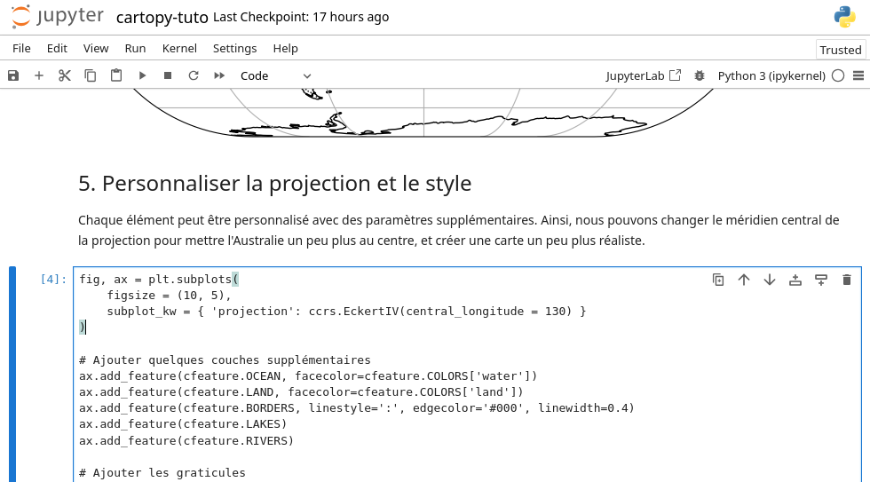

# Géoinformatique 1: SIG par la programmation

Tom Beucler  
Christian Kaiser  

---

# Objectifs

Connaître les différents environnements de programmation, et les avantages et limites des logiciels SIG respectivement des scripts de programmation

Comprendre l'utilité de la programmation dans le contexte des SIG, dont notamment:

- automatisation de tâches répétitives
- faciliter la reproductibilité par scripts

Comprendre les limites de la programmation et l'utilité d'une interface graphique:

- tâches graphiques

---

# Environnements de programmation

Python peut être utilisé de plusieurs façons:

- Dans un notebook (Jupyter, Google Colab, ...)

- Dans une IDE (p.ex. PyCharm, VS Code, ...)

- Comme script depuis la ligne de commande  
  `python script.py`

- À l'intérieur d'un logiciel comme langage de script

---

# Environnement notebook

---

# Environnement notebook

- Mélange entre texte et code
    - contexte est présent
    - transparence / reproductibilité

- Relativement facile à mettre en place:
    - dans le Cloud (Google Colab)
    - sur l'ordinateur personnel (Anaconda)

- Pas de script brut exécutable

---

# IDE

- IDE = Integrated Development Environment

- Éditeur de texte avec support pour le langage de programmation

- Focalise généralement sur l'écriture de scripts et moins sur l'exécution

- Exemples pour Python:
    - PyCharm, Visual Studio Code, IDLE, Spyder

---

# Script ligne de commande

- Chaque code Python peut être enregistré dans un fichier `.py`

- Depuis la ligne de commande, il suffit d'appeler  
  `python <nom-du-script>.py` ou  
  `python.exe <nom-du-script>.py`

- Focalise sur l'exécution du code

---

# Langage de script dans logiciel

- Exécution dans un contexte précis

- Pour:
    - automatiser des tâches
    - étendre le logiciels (p.ex. plugins)
    - assurer la reproductibilité

- Exemple: QGIS avec PyQGIS

---

# Avantages des scripts

- Tâches répétitives (automatisation)

- Reproductibilité:
    - script permet de refaire les mêmes opérations encore une fois
    - assure la transparence

- Peut être utilisé dans un contexte après adpatation (copier-coller facile)

- Flexibilité dans les tâches:
    - il y a toujours un moyen d'accomplir une tâche précise
    - moins de dépendance sur ce qui est mis à disposition dans un logiciel

---

# Limites des scripts

- Prend parfois plus de temps à mettre en place
    - mais: on peut profitez des scripts déjà écrits, on devient de plus en plus rapide

- Certaines tâches graphiques sont difficiles, p.ex.
    - la numérisation de géométries dans un SIG
    