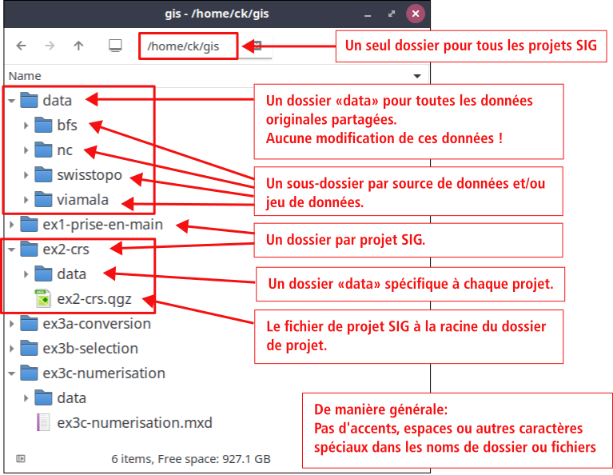

# Exercice: démarrer avec QGIS

Objectifs de l'exercice:

- Installer QGIS sur votre ordinateur personnel

- Prendre en main le logiciel:
    - afficher des données vectorielles et raster
    - faire une symbologie simple
    - inspecter les propriétés et propriétés
    - effectuer quelques manipulations de base

- Définir un système de coordonnées approprié et projeter une couche

- Ajouter des données depuis un service Web (service WMS)

- Organiser correctement un projet QGIS


## 1. Installation de QGIS

[QGIS](https://qgis.org/) est un logiciel de Système d'Information Géographique (SIG) libre et ouvert (Free and Open Source Software). Il est disponible sur les systèmes d'exploitations principaux (Linux, Windows, macOS).

Installez la dernière version LTR («long terme») du logiciel. Si vous préférez, vous pouvez aussi installer la dernière version. Notez cependant que la documentation QGIS se réfère souvent à la version LTR actuelle. Par ailleurs, c'est une bonne pratique de désinstaller d'autres versions antérieures de QGIS (2.18, 3.16, etc.) avant d'en installer une nouvelle.

La [page de téléchargement](https://qgis.org/download/) vous guidera en fonction de votre système d'exploitation. À noter pour les utilisateurs de macOS qu'à la première ouverture de QGIS un message d'erreur *«impossible d'ouvrir QGIS car Apple ne peut pas vérifier qu'il ne contient pas de logiciels malveillants»* peut survenir. Pour régler ça, il faut aller sous «Préférences Système > Sécurité et confidentialité > Général» pour autoriser QGIS manuellement car c'est une application qui ne vient pas de développeurs identifiés par Apple.

Vous trouverez également une documentation détaillée (dans de multiples langues) sur les fonctionnalités de base ainsi que celles plus avancées sur le [site officiel](https://docs.qgis.org/3.34/fr/docs/index.html). En cas de problème, le forum QGIS de [GeoRezo](https://georezo.net/forum/viewforum.php?id=55) est, en plus d'être très actif, une bonne source francophone d'aide.


## 2. Prise en main de QGIS

La vidéo [«Les premiers pas avec QGIS»](https://youtu.be/1cEPEv934KE) donne une introduction sur les manipulations de base dans un SIG. La vidéo explique notamment le chargement des couches vectorielels et ratser, tout comme la définition d'un style simple ainsi le principe de l'ordre des couches et la consultation de la table d'attributs. Il est également montré comment modifier le système de coordonnées d'affichage de la carte (donc le système de coordonnées d'affichage du projet SIG, et non pas le changement du système de coordonnées des données).

Téléchargez également les données utilisées dans la vidéo depuis l'URL suivante: [https://geoinformatique.ch/donnees](https://geoinformatique.ch/donnees).


...


## 3. Définition du système de coordonnées d'une couche et projection

Consultez la vidéo [«QGIS: Gérer les systèmes de coordonnées et projections»](https://youtu.be/jqEdzv-WsLc).

Il est important de distinguer le système de référence spatial (SRS) d'affichage du projet SIG et le système de coordonnées utilisé pour encoder les coordonnées dans les données vectorielles ou raster.

La vidéo explique notamment dans quelles (rares) cas il faut **définir** le système de coordonnées d'une couche.

La vidéo explique également comment on peut **projeter une couche**, c'est-à-dire **changer** le système de coordonnées d'une couche.

En gros, si l'Europe se trouve en Afrique sur votre carte, ce n'est certainement pas à cause de la tectonique des plaques, mais probablement parce que vous avez mal réglé le système de coordonnées dans votre SIG! Dans ce cas, il est une bonne idée de revoir la vidéo...


## 4. Ajouter des données depuis un service Web

Dans le contexte des SIG, un service Web permet de partager et d'accéder et parfois manipuler des données géographiques à travers Internet. Ceci se fait à travers un service Web hébergé sur un serveur et mis à disposition par une organisation, avec l'avantage que les données sont faciles d'accès et aucun téléchargement ne doit être fait.

Les services Web sont définis par l'Open Geospatial Consortium (OGC) qui a comme but de développer des standards ouverts permettant ainsi d'échanger facilement des données et même des services de géotraitement. Ainsi, ces standards permettent de garantir **l'interoparabilité** des SIG, c'est-à-dire qu'ils peuvent fonctionner avec différents logiciels et plateformes sans problème de compatibilité.

Il y a plusieurs types de services, dont notamment:

- le **WMS (Web Map Service)** qui permet de visualisation des cartes sous formes d'**images**.

- le **WFS (Web Feature Service)** qui donne accès aux **données vectorielles** (donc aux couches vectorielles directement).

Beaucoup d'organisations mettent à disposition des données au public sous forme de service WMS. Ceci nous permet d'ajouter beaucoup de données à un projet SIG sans devoir télécharger les données (qui peuvent être très volumineuses).

Il faut être conscient que **les données WMS sont des images**. Ceci a l'avantage qu'il ne faut pas définir de style comme pour des couches vectorielles qui ne contiennent aucune information de représentation graphique. Par contre, le désavantage est qu'on ne peut pas changer cette représentation et qu'il est impossible d'utiliser ces données dans un processus d'analyse où les attributs sont importants.

QGIS permet d'ajouter plusieurs serveurs WMS, et chaque serveur WMS possède généralement plusieurs couches d'informations qui peuvent être ajoutées à la carte.

Consultez la vidéo [«QGIS: Ajouter un service WMS ou WMTS»](https://youtu.be/voNmaJE1HE4) pour voir comment ajouter le serveur WMS de Swisstopo. Grâce à ce serveur, vous pouvez ajouter presque toutes les couches disponibles dans le [portail cartographique de la Confédération](https://map.geo.admin.ch) directement dans votre SIG (mais toujours sous forme d'image...).

Voici le lien à utiliser dans QGIS pour le serveur WMS de Swisstopo:

```text
https://wmts.geo.admin.ch/EPSG/2056/1.0.0/WMTSCapabilities.xml?lang=fr
```

Si vous préférez la description des couches en allemand ou italien, changez simplement le paramètre de la langue à la fin de l'URL.

Veuillez également consulter la description de ce service offert par Swisstopo à la page suivante: 
[Web Map Tiling Services WMTS: Services et données disponibles](https://www.geo.admin.ch/fr/wmts-services-et-donnees-disponibles)

La configuration du service WMS doit être faite en principe qu'une fois, QGIS gardera en mémoire la configuration.


...


## 5. Organiser correctement un projet QGIS

Un projet SIG consiste en un fichier de projet ainsi que les données liées. Dans QGIS, le fichier de projet est d'un fichier avec extension .qgs ou .qgz. Les fichiers de projet ne contiennent aucune données. Les fichiers de projet contiennent uniquement une référence vers le jeu de données SIG, c'est-à-dire généralement le chemin d'accès des données (donc sur Windows quelque chose comme C:\Users\xyz\...).

L'avantage de ce système est que les fichiers de projet restent gérables au niveau de la taille, et que nous pouvons utiliser le même jeu de données dans plusieurs fichiers de projet SIG.

L’inconvénient est que nous devons avoir une organisation rigoureuse et bien réfléchie des données et projets. Il est important de ne pas déplacer les données SIG, sinon le chemin d'accès des données change et le logiciel SIG ne trouvera plus les données à charger lors de l'ouverture du fichier de projet.

De manière pratique, il y a plusieurs façon d'organiser les données et les projets. Cependant, afin de simplifier les choses surtout au début, nous proposons de suivre les conseils suivants:

1. Créer un dossier `gis` (ou `sig` ou similaire) dans notre dossier d'utilisateur ou dans votre dossier des documents.. Sur Windows, c'est typiquement C:\Users\xx\Documents\gis où xx est votre nom d'utilisateur. Sur macOS, ce serait plutôt le chemin /Users/xx/Documents/gis, et sur Linux /home/xx/Documents/gis.

   **Important**: n'utilisez pas d'espaces ou caractères spéciaux comme des accents etc. dans tous vos noms de dossiers et fichiers. Si votre nom d'utilisateur contient un accent ou un espace, vous pouvez toujours créer votre dossier directement à la racine C:\, ou vous créer un nouvel utilisateur. Un nom d'utilisateur est idéalement très simple; il peut consister uniquement de vos initiales (en minuscules, donc p.ex. ae pour Albert Einstein).

   Généralement, il est préférable d'utiliser uniquement des caractères en minuscules pour vos noms de dossiers et fichiers. Les différentes systèmes d'exploitation gèrent différemment la casse, et si on ne fait pas attention, on risque d'avoir des problèmes si on doit ouvrir un projet SIG sur un ordinateur avec un autre système d'exploitation.

2. À l'intérieur du dossier `gis`, vous créez un dossier `data`. Pour chaque jeu de données SIG que vous téléchargez de quelque part, vous allez créer un sous-dossier à l'intérieur de ce dossier (il est aussi possible de créer des sous-dossiers dans un sous-dossier, il faut juste que ce soit logique et que ça ne change plus une fois que c'est défini). Donc pour un jeu le jeu de données de Swisstopo, vous pourrez créer un dossier `swisstopo` à l'intérieur de `data`. Ce sont les données que vous allez utiliser pour l'ensemble de vos projets SIG. **Ne modifiez pas ces données, ce sont les données originales** (vous pouvez éventuellement changer le format des données, mais sans en changer le contenu).

3. Pour chaque projet SIG que vous faites, vous créez un dossier dans `gis` (vous pouvez aussi faire un sous-dossier projets et créer un dossier par projet à l'intérieur si vous préférez). Dans chaque dossier de projet, vous créez à nouveau un dossier `data` avec les données spécifiques du projet, ensemble avec votre fichier de projet.

   À la fin, vous aurez une structure qui ressemblera à quelque chose comme ça:

   


La vidéo [«QGIS: Structurer les fichiers et dossiers de vos projets SIG»](https://youtu.be/ROI3_h5cFvg) montre cette structure de manière concrète.


### Exercice

Créez la structure décrite ci-dessus sur votre ordinateur. Ensuite:

1. Insérez les données téléchargées à l'étape 1 (les «GIS Starter Data») et déposez les dans le dossier approprié.

2. Créez ensuite un dossier de projets pour votre projet individuel selon les instructions données dans la section correspondante.
