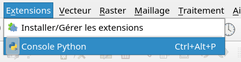
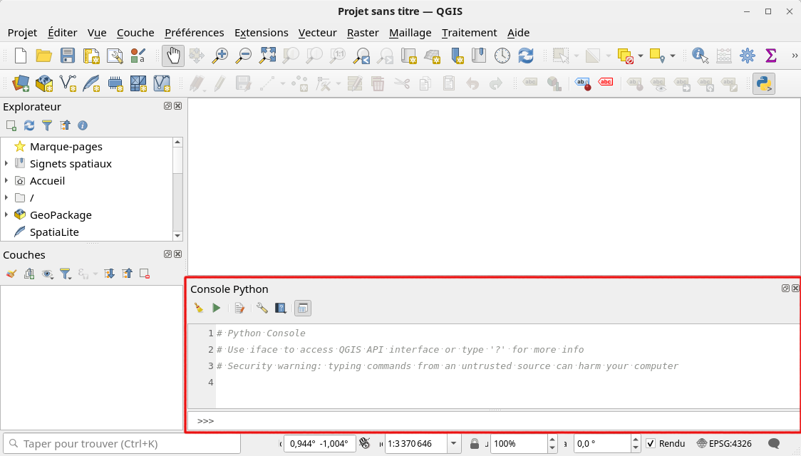
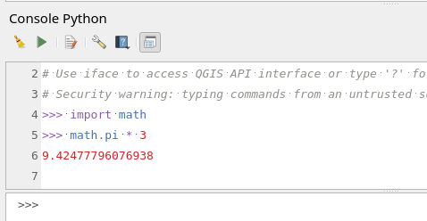
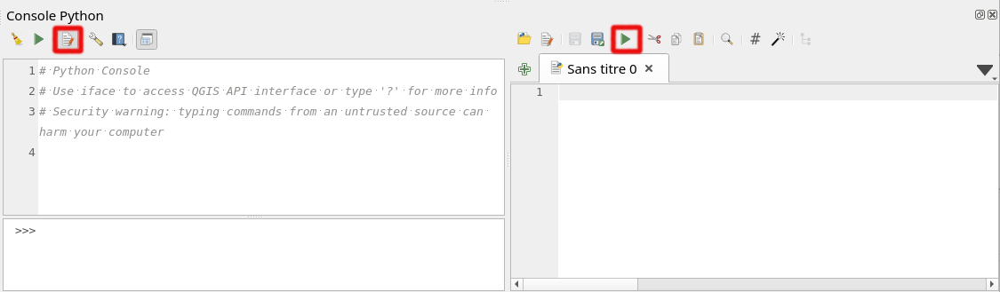
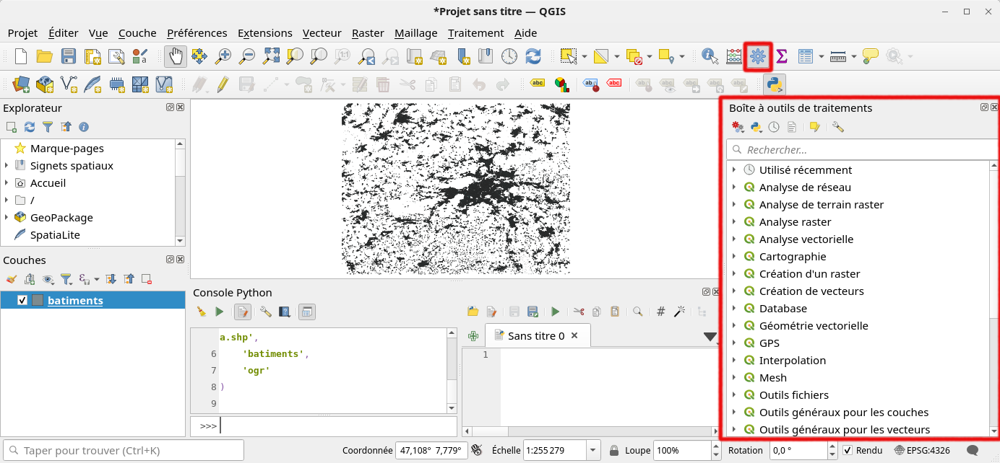
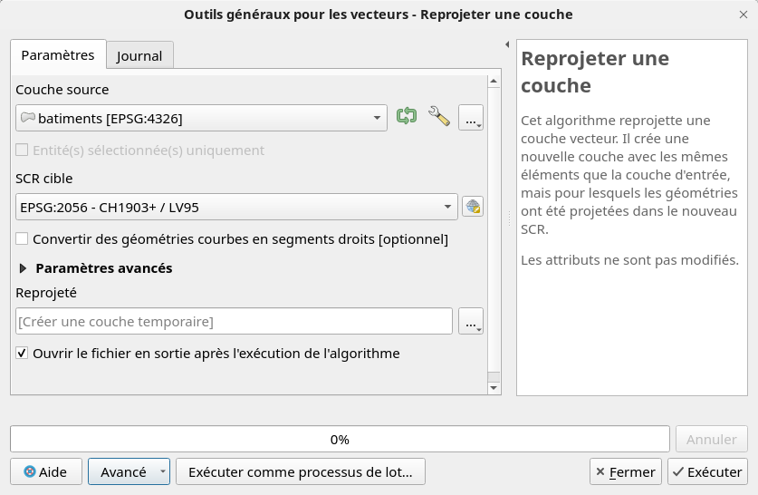
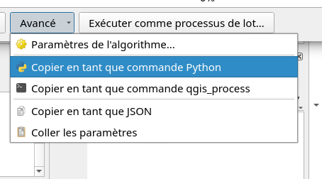

# Introduction à PyQGIS

QGIS est un logiciel écrit en C++, mais il est construit en sorte à ce que l'utilisateur peut interagir avec le logiciel en Python. Ceci permet:

- d'exécuter des tâches répétitives à l'aide d'un script Python

- de disposer d'un script Python qui donne une transparence totale sur les manipulations effectuées dans QGIS

- d'étendre les possibilités de QGIS, p.ex. en effectuant certaines tâches à l'aide d'un module Python spécialisé

- d'écrire des plugins QGIS et ainsi rendre accessible des nouvelles fonctionalités à l'ensemble de la communauté QGIS

Il y a trois façons pour faire tourner du code Python dans QGIS:

1. À l'aide de la console Python intégrée dans QGIS
2. En exécutant un script Python depuis QGIS, ou depuis une console ligne de commande
3. Sous forme d'un plugin


## La console Python

La console Python est intégrée dans QGIS. Elle peut être affichée par le menu Extension > Console Python:



ou par le bouton correspondant avec l'icône Python dans barre d'outils *Extensions*.

La console s'affiche généralement en bas à droite, mais peut être déplacée n'importe où:



La console fonctionne selon le principe **REPL**: Read, Execute, Print Loop. Ceci veut dire que chaque commande écrite dans la console est lue et exécutée directement. Le résultat est ensuite affichée dans la console. Il s'agit d'une boucle (loop), car ensuite on peut entrer la commande suivante.

La console permet d'exécuter en principe n'importe quel code Python, même sans lien avec QGIS. On peut définir des variables, ou faire des calculs comme d'habitude:



Si un module Python doit être installée, nous pouvons le faire avec l'outil de ligne de commande `pip`. La console QGIS supporte les outils de ligne de commande, il suffit de commencer une ligne de code avec `!`. Donc p.ex. pour installer le module `pooch` pour télécharger des données, on pourrait l'installer avec

```python
!pip insall pooch
```


## Ajouter une couche vectorielle

Le but de la console Python n'est évidemment pas de faire quelques calculs simples avec Python. Le but est d'interagir avec QGIS. Toutes les actions qui sont possibles dans l'interface graphique de QGIS sont également accessibles avec Python.

L'interface QGIS est accessible dans Python par la variable `iface` qui est définie automatiquement au lancement de Python. Une méthode accessible par cette variable `iface` est `addVectorLayer`. Il faut indiquer le chemin d'accès de la couche vectorielle sur le disque dur, le nom de la couche dans QGIS, et avec quel méthode la couche doit être chargée (la méthode correspond en gros à la barre latérale de gauche dans le gestionnaire des sources de données).

Nous pouvons charger une couche vectorielle de la façon suivante (l'exemple utilise les [GIS Starter Data](https://www.geoinformatique.ch/data/gis-starter-data) mais fonctionne avec n'importe quelles données):

```python
lyr_osm_bati = iface.addVectorLayer(
    '/home/tux/sig/data/gis-starter-data/osm/greater-bern-extract/gis_osm_buildings_a.shp',
    'batiments',
    'ogr'
)
```

Nous pouvons obtenir les attributs et en afficher le nom:

```python
for attr in lyr_osm_bati.fields():
    print(attr.name())
```

Et pour ouvrir la table d'attributs:

```python
iface.showAttributeTable(lyr_osm_bati)
```

La couche en question possède un attribut `type` qui correspond au type de bâtiment selon les données OSM. Nous pouvons faire un décompte par type de bâtiment. Pour cela, nous pouvons faire obtenir toutes les entités (features) et extraire la valeur pour l'attribut `type`. Pour le comptage, nous utilisons un dictionnaire un peu spécial où la valeur est zéro pour chaque nouvelle clé:

```python
from collections import defaultdict

# Créer le dictionnaire qui permet de stocker le nombre de bâtiments
# par type. Une nouvelle valeur dans le dictionnaire sera toujours 0.
type_cnts = defaultdict(int)

# Obtenir les entités de la couche chargée plus haut.
batiments = lyr_osm_bati.getFeatures()

# Faire une boucle à travers tous les bâtiments
for bati in batiments:
    type_bati = bati['type']
    # Gérer les bâtiments sans type défini
    if not type_bati:
        type_bati = 'non défini'
    # Compter 1 pour le bâtiment
    type_cnts[type_bati] += 1

# Afficher le nombre d'écoles et églises
print(f"Écoles: {type_cnts['school']}")
print(f"Églises: {type_cnts['church']}")
```

## Scripts Python

Dans la console Python, il faut saisir chaque instruction à la fois. Ça va bien pour juste essayer une commande. Par contre, pour faire tourner plusieurs lignes de code, il faut une autre méthode. Pour cela, il y a des fichiers de script.

La console Python contient un éditeur de scripts Python. Il suffit de cliquer sur le bouton correspondant et l'éditeur s'affiche à droite:



Un script peut être enregistré sur le disque pour garder une trace et pour l'exécuter plus tard. Un script Python a toujours une extension `.py`. Pour faire tourner le script actif dans l'éditeur Python, il suffit de cliquer sur le bouton avec le triangle vert.


## Outils de géotraitement

QGIS possède un grand nombre d'outils de géotraitements. Elle peut être affichée avec le menu Traitement > Boîte à outils, ou avec le bouton dans la barre d'outils correspondante.



Tous les outils fonctionnent selon le même principe: un double-clic ouvre le dialogue d'outil permettant de paramétriser le traitement. Voici l'exemple pour projeter la couche des bâtiments OSM en coordonnées suisse (en créant une couche temporaire):



Pour la création de scripts, le bouton «Avancé» en bas de la fenêtre est intéressant. Il donne accès, entre autres, à la commande Python correspondant au traitement configuré en haut. Ainsi, il est possible d'effectuer un géotraitement, et une fois qu'il a tourné de manière satisfaisante, on peut copier la commande pour l'écriture du script Python.



En l'occurrence, la commande correspondante est assez longue. Il est généralement conseillé de formater un peu le code pour augmenter la lisibilité et ainsi la compréhension. Un bouton pour le faire est proposé en dessus de l'éditeur de code.


## Pour aller plus loin...

- [Documentation PyQGIS](https://qgis.org/pyqgis/master/index.html)
- [PyQGIS Cookbook](https://docs.qgis.org/3.40/en/docs/pyqgis_developer_cookbook/index.html)
- [PyQGIS 101: Introduction to QGIS Python programming for non-programmers](https://anitagraser.com/pyqgis-101-introduction-to-qgis-python-programming-for-non-programmers) par Anita Graser
